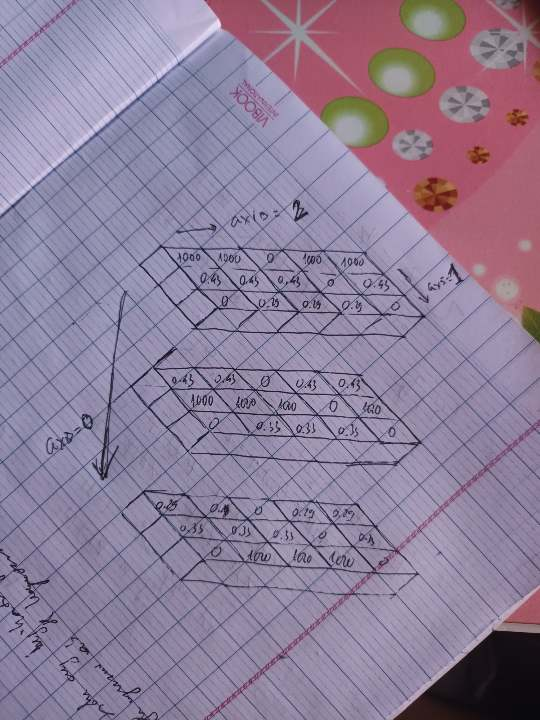

# Side quest: Revisiting numpy (1)

*Programming* *Numpy* *Bit quest*   
*12-14/04/2024 (3 days)*

## Tid bits
- I'm a fast learner - that is, I understand things and connect things very fast when I get the idea. 
- But I'm slow at "getting the idea" - especially in things I'm not fluent in like programming and maths. The best way to get around this is for me to ask. 
	- Fastest -> LLM. They still sucks though they will give me a hypothesis.
	- Best -> Ask people who understand (the stealing part). But they are not immediate. And one of the mistake I make when asking others is unable to evaluate (in other word, lazy to) if I understand the subject, and not press till I get it. I **must** do to **end things**.
- For now, formulating a hypothesis is difficult and it takes me a long time to actualy get there.
- When I **can formulate hypothesis** -> qualitative change (biến đổi về chất) -> **a new space is created** -> **The goal (the point)**.


## Main bits
### 1. Numpy broadcasting and 3D array:
- Formula:
```
	 2 3 1 5 6
	   1 4 5 1
         4 1 6
    -----------
     2 3 4 5 6
```
- Numpy display an array with dimension from right to left - the "closest" first, then the 'furthest'.
(4, 3, 2) 

```
-> [[[1, 1], [1,1], [1,1]], 
	[[1, 1], [1,1], [1,1]],
	[[1, 1], [1,1], [1,1]],
	[[1, 1], [1,1], [1,1]]]
```
### 2. Ex.Numpy sum in big dimension
```
weights = 
	[[[1.0e+03, 1.0e+03, 0.0e+00, 1.0e+03, 1.0e+03],
	[4.3e-01, 4.3e-01, 4.3e-01, 0.0e+00, 4.3e-01],
	[0.0e+00, 2.9e-01, 2.9e-01, 2.9e-01, 0.0e+00]],

	[[4.3e-01, 4.3e-01, 0.0e+00, 4.3e-01, 4.3e-01],
	[1.0e+03, 1.0e+03, 1.0e+03, 0.0e+00, 1.0e+03],
	[0.0e+00, 3.3e-01, 3.3e-01, 3.3e-01, 0.0e+00]],

	[[2.9e-01, 2.9e-01, 0.0e+00, 2.9e-01, 2.9e-01],
	[3.3e-01, 3.3e-01, 3.3e-01, 0.0e+00, 3.3e-01],
	[0.0e+00, 1.0e+03, 1.0e+03, 1.0e+03, 0.0e+00]]]

weights.shape = 3.3.5
```

```
np.sum(weights, axis=0) =
	[[1000.72, 1000.72,    0.  , 1000.72, 1000.72],
	[1000.76, 1000.76, 1000.76,    0.  , 1000.76],
	[   0.  , 1000.62, 1000.62, 1000.62,    0.  ]]
.shape = 3.5
```

```
np.sum(weights, axis=1) = 
	[[1.00043e+03, 1.00072e+03, 7.20000e-01, 1.00029e+03, 1.00043e+03],
    [1.00043e+03, 1.00076e+03, 1.00033e+03, 7.60000e-01, 1.00043e+03],
    [6.20000e-01, 1.00062e+03, 1.00033e+03, 1.00029e+03, 6.20000e-01]]

.shape = 3.5
```

```
np.sum(weights, axis=2) = 
	[[4.00e+03, 1.72e+00, 8.70e-01],
	[1.72e+00, 4.00e+03, 9.90e-01],
	[1.16e+00, 1.32e+00, 3.00e+03]]
.shape = 3.3
```
- Explaination: Provided by HCK.

### 3. Ex. Explain weight normalization
```
similarities = np.expand_dims(similarities, axis=2)
weights = similarities*~np.isnan(ratings_mat)
weights = weights/np.expand_dims(np.sum(weights, axis=1), axis =1)
```

- The first: Add another dimension for calculation.
- The second: Apply mask so that element of nan (no common film) is reprent as 0. Everythin else is the same.
- The third: 
	- `np.sum(weights, axis=1)`: Calculating the sum of similarities of a user to others (by rows) for all **films** **(by columns)**.
	- `np.expand_dims`: Expand dimentions for calculation.
	- `weight/`: calculate the ratio of weight on each user film wise. Aka. user A is closest to user B on film 1, and the distance between user A to all user using film 1 is normalize to `= 1`.

### Resources:
*Mostly comes from [Lex Maximov](https://levmaximov.medium.com/)*
1. https://levmaximov.medium.com/numpy-illustrated-the-visual-guide-to-numpy-3b1d4976de1d
2. https://towardsdatascience.com/broadcasting-in-numpy-58856f926d73
3. https://github.com/rougier/numpy-100/blob/master/100_Numpy_exercises.ipynb 

New Lead:
1. Einstein sum: https://betterprogramming.pub/einsum-visualized-c050903145ef